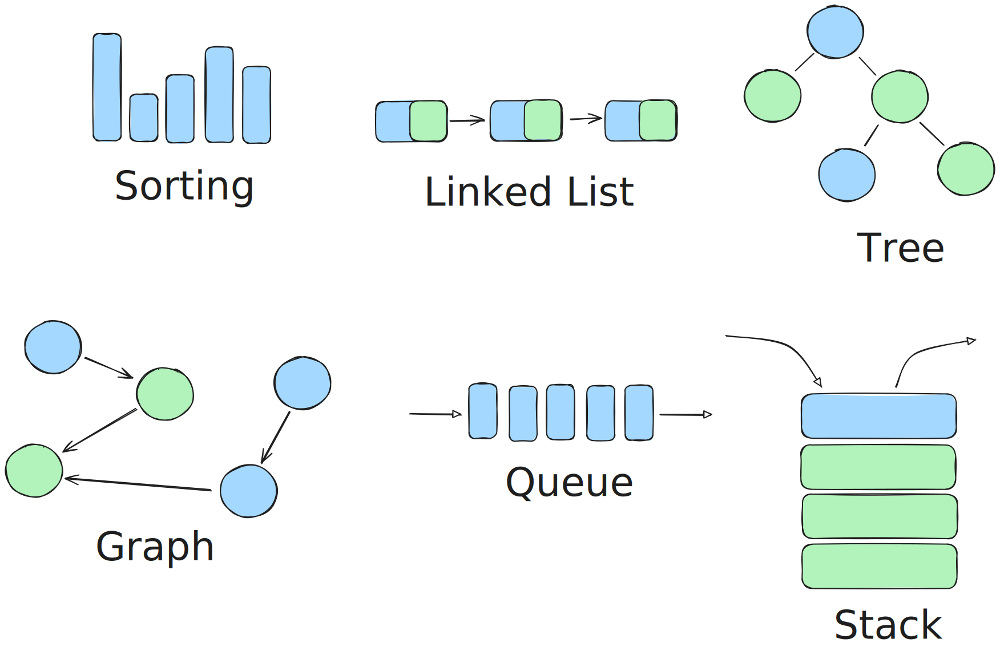

# Data Structures & Algorithms (DSA) Notes

This repository is dedicated to learning **Data Structures and Algorithms (DSA)**.  
It contains my **notes** and **code implementations** created while training in the **SkillStack Path at Gaza Sky Geeks** under **Dr. Refat Othman**.  
I also collect and organize useful information from other resources to strengthen my understanding.

---

## My Notes

### 1. Introduction to DSA

- [Asymptotic Analysis](./my_notes/asymptotic-analysis.md) - Big O notation and why it matters
- [Data Structures](./my_notes/introduction-data-structures.md) - What are Data Structures
- [Space Complexity](./my_notes/space-complexity.md) - What is Space Complexity and Space Vs. Time Complexity
- [Logarithms & O(log n)](./my_notes/logarithms.md) usage of the efficient O(log n) and from where get the logarithm formula

### 2. Data Structures

- [Linked List](./my_notes/linked-list.md) - Linear Data Structure where elements connected using pointers
- [Stack](./my_notes/stack.md) - LIFO
- [Queue](./my_notes/queue.md) - FIFO
- [Tree](./my_notes/tree.md) - Non-Linear Data Structure with parent-child relationship
  - [AVL-Tree](./my_notes/avl_tree.md) Self-Balancing BST
- [Graph](./my_notes/graph.md)
- [Heap](./my_notes/heap_priority_queues.md)
- [Hash Tables](./my_notes/hash-tables.md) - Non-Linear Data Structure with speed look-up access

### 3. Algorithms [just huffman_code]

- [Recursion](./my_notes/recursion.md) - function call itself
- [Huffman Coding Algorithm](./my_notes/huffman-coding-algorithm.md) - algorithm to compression the files
- Sorting Algorithms
  - [Bubble Sort](./my_code/Algorithms/sorting_algorithms/bubble_sort.py)
  - [Insertion Sort](./my_code/Algorithms/sorting_algorithms/insertion_sort.py)
  - [Selection Sort](./my_code/Algorithms/sorting_algorithms/selection_sort.py)
  - [Heap Sort](./my_code/Data_Structures/heap/heap_sort.py)
- searching Algorithms
  - [Binary Search](./my_code/Algorithms/searching_algorithms/binary_search/binary_search.py)
  - [Linear Search](./my_code/Algorithms/searching_algorithms/linear_search/linear_search.py)
  - [String Search](./my_code/Algorithms/searching_algorithms/string_search/string_search%20[naive].py)
- common Problem Solving Patterns
  - [IN_PROGRESS...]
  - [[Frequency Counter]]
  - [[Multiple Pointers]]
  - [[Sliding Window]]
  - [[Divide And Conquer]]

### 4. Interview Questions

- [Interview Questions](./my_notes/interview-questions.md)

---
