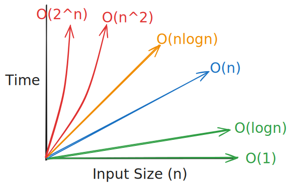
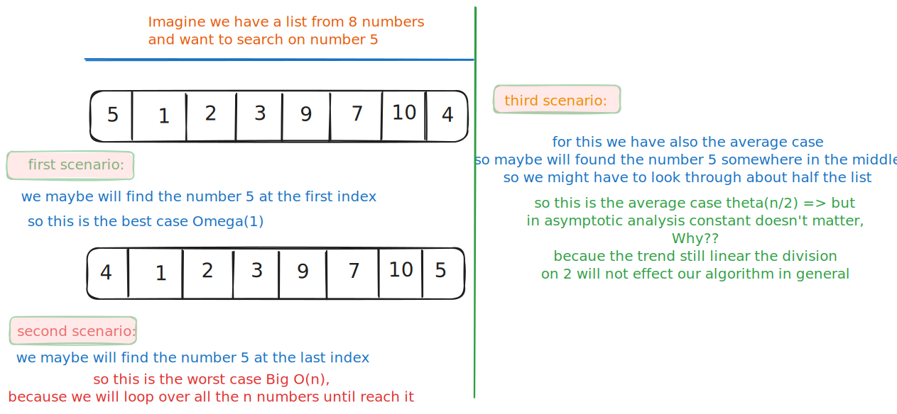

# Asymptotic Analysis

## Table of Contents

1. [What is Asymptotic Analysis](#what-is-asymptotic-analysis)
2. [#When to use it](#when-to-use-it)
3. [#Who it works](#who-it-works)
4. [#Tools of Asymptotic Analysis (Notations)](#tools-of-asymptotic-analysis-notations)
5. [#Comparing Algorithms](#comparing-algorithms)
6. [#Important Notes](#important-notes)
7. [#Why Not Use Timers](#why-not-use-timers)
8. [#Some Tricks](#some-tricks)
9. [#Summary](#summary)

---



## What is Asymptotic Analysis

> **Asymptotic analysis** is a method to analyze the **performance** of an algorithm by measuring how its **runtime** or **space usage** grows when the input data size increases.

> Its like predicting how a city's traffic will change when its **population grows** - we're **not counting exact cars, but understanding the overall trend.**

---

## When to use it

- Asymptotic analysis essential during **algorithm design and analysis**:
  - Why?!
    1. **Compare multiple algorithms** and choose the best solution and best performance.
    2. explain to you **how your code will performs when data growing** (Scalability)
    3. very important in Coding **interviews**, and **competitive Programming**
    4. building applications that **handle millions of users**

---

## Who it works

- Instead of guessing which solution is better, we use **mathematical precision**:

```
❌ "This code looks faster"
✅ "This algorithm is O(n log n) while the other is O(n²)"
```

---

## Tools of Asymptotic Analysis (Notations)

> **Mathematical functions** describe algorithm behavior using **n** (input size)

### Three Types of Notations

#### **1. Big O (O) - Upper Bound (Worst Case)**

- **Definition**: Maximum time/space the algorithm will **ever** take
  - **It will never be slower than this**

#### **2. Theta (Θ) - Tight Bound (Average Case)**

- **Definition**: Typical performance across all inputs
  - **It usually performs like this**

#### **3. Omega (Ω) - Lower Bound (Best Case)**

- **Definition**: Minimum time/space the algorithm **could** take
  - **It will never be faster than this**

### Example



### Visualization

- This Table shows how **algorithms perform** when **input size grow**

| Input Size (n) | Constant O(1) | Logarithmic O(log n) | Linear O(n) | Quadratic O(n²) | Exponential O(2ⁿ)         |
| -------------- | ------------- | -------------------- | ----------- | --------------- | ------------------------- |
| **1**          | 1 step        | 1 step               | 1 step      | 1 step          | 2 steps                   |
| **10**         | 1 step        | 3 steps              | 10 steps    | 100 steps       | 1,024 steps               |
| **100**        | 1 step        | 7 steps              | 100 steps   | 10,000 steps    | 1.2×10³⁰ steps            |
| **1,000**      | 1 step        | 10 steps             | 1,000 steps | 1,000,000 steps | ♾️ (practically infinite) |

---

## Comparing Algorithms

### What Does "Better" Mean?

When comparing algorithms, we might consider:

- **For algorithmic analysis, we focus on counting fundamental operations rather than subjective measures.**

We compare algorithms by counting **primitive operations**:

- **Arithmetic**: `+`, `-`, `*`, `/`
- \*\*Assignments: = , += , -=
- **Compression: ** < , > , == , !=
- **Array access:** `arr[i]`
- **Loop iterations**
- **Function calls**

**Example of Comparing two algorithms based on number of operations:**
[compare-algorithms](../attachment/images/compare-algorithms.svg)

---

## Important Notes

1. **Constants Don't Matter**
   - We focus on **growth trends**, not exact coefficients.
   ```
   O(3n + 5) → O(n)
   O(2n²) → O(n²)
   ```
2. Nowadays we **just focus on time complexity** because **modern computers have enough space**
3. **Operations Include Everything** Even `return` statements count as operations in our analysis.

---

## Why Not Use Timers

**Timing is Unreliable:**

- Same code will may runs in different speeds on different machines
  - or even sometimes this happens in the same machine
- very fast algorithms may complete faster than the timer itself

**Big O is Reliable:**

- Always gives the same result for the same algorithm

> **In Short:**
>
> - **Timing** => machine-dependent
> - **Big O Analysis** => machine-independent

---

## Some Tricks

- Some Tricks to know the time complexity of an algorithm

| **Complexity** | **Pattern**         | **Examples**                           | **Code Hint**                      |
| -------------- | ------------------- | -------------------------------------- | ---------------------------------- |
| **O(1)**       | Single operation    | Variable access, arithmetic            | `x = 5`, `if (x > 0)`              |
| **O(log n)**   | Halving the problem | Binary search, tree traversal          | `i *= 2`, `i /= 2`                 |
| **O(n)**       | Single loop         | Linear search, array traversal         | `for (i = 0; i < n; i++)`          |
| **O(n log n)** | Loop with halving   | Merge sort, heap sort                  | Loop + binary search inside        |
| **O(n²)**      | Nested loops        | Bubble sort, nested iterations         | `for` inside another `for`         |
| **O(2ⁿ)**      | Exponential growth  | Recursive Fibonacci, subset generation | Each call makes 2+ recursive calls |

---

## Summary

1. Asymptotic Analysis **Describe** how algorithms behave when the input gets **larger**
2. We just care about **general trend**, not each milliseconds
3. It **uses mathematical methods** (notations) to describe performance of the algorithm
4. works same across different programming languages and machines
   - **Machine-Independent**: Works regardless of your computer's speed or specifications
   - **Language-Independent**: Same analysis applies whether you use Python, Java, or C++
   - **Future-Proof**: Predictions remain valid as your data grows
