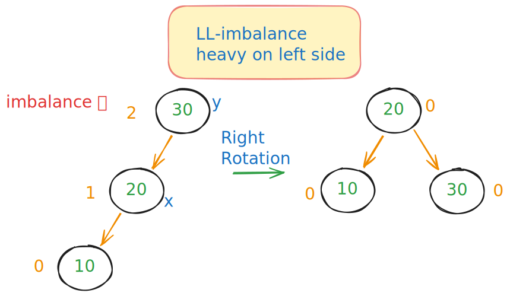
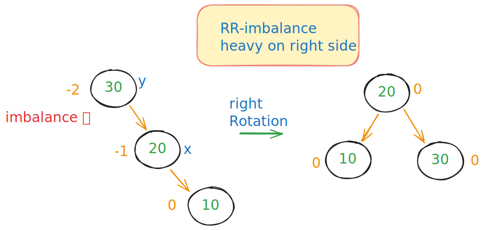
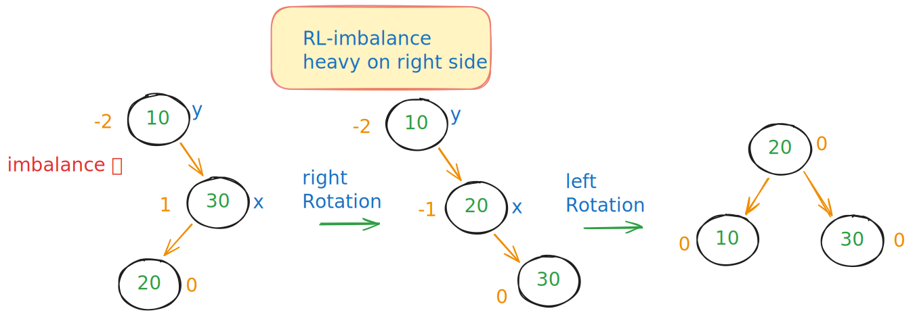
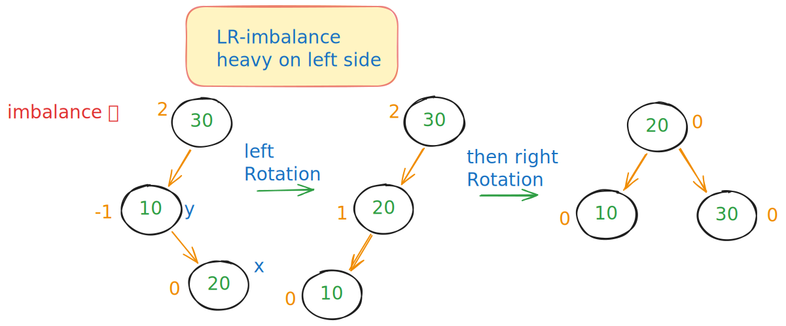
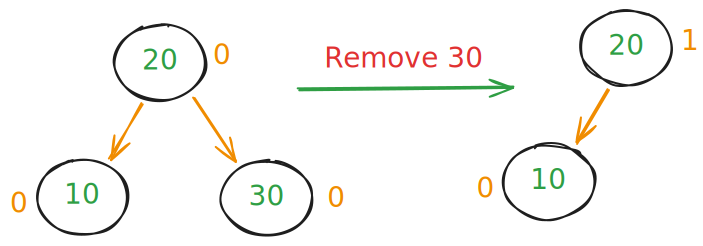
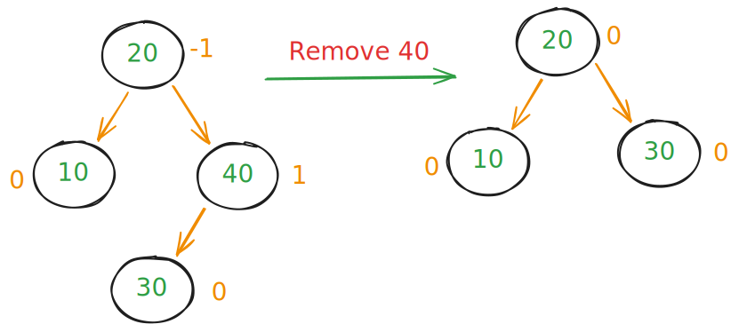
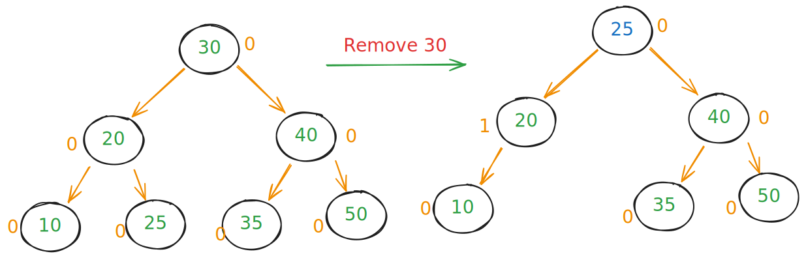

# AVL Trees — Self-Balancing Binary Search Tree (BST)

## Table of Content

- [What is an AVL Tree](#what-is-an-avl-tree)
- [AVL Tree Rotations](#avl-tree-rotations)
  - [Case 1 Single Right Rotation (Left-Left)](#case-1-single-right-rotation-left-left)
  - [Case 2 Single Left Rotation (Right-Right)](#case-2-single-left-rotation-right-right)
  - [Case 3 Double Rotation (Right-Left)](#case-3-double-rotation-right-left)
  - [Case 4 Double Rotation (Left-Right)](#case-4-double-rotation-left-right)
- [AVL Tree Deletion Scenarios](#avl-tree-deletion-scenarios)
  - [1. Deleting a Leaf Node](#1-deleting-a-leaf-node)
  - [2. Deleting Node with One Child](#2-deleting-node-with-one-child)
  - [3. Deleting Node with Two Children](#3-deleting-node-with-two-children)
  - [Deletion Causes Imbalance (Requires Rotation)](#deletion-causes-imbalance-requires-rotation)
- [My Code Implementation](#my-code-implementation)
- [Interview Questions](#interview-questions)

---

## What is an AVL Tree

An **AVL tree** (named after Adelson-Velsky and Landis) is a **self-balancing BST**.

- For every node, the **balance factor** = `height(left subtree) - height(right subtree)`
- The balance factor is always in the range **\[-1, 0, +1]**

### Why we use AVL

- In normal BST:
  - sorted insertions can make the tree degenerate into a **linked list** → **O(n)** time
- So we use AVL Trees maintain **log(n)** height → O(log n) time for search, insert, and delete

---

## AVL Tree Rotations

> To restore balance after insertions/deletions:

---

### Case 1: Single Right Rotation (Left-Left)

**Example:**

- Used when **left subtree is heavy** (balance factor > 1) and the inserted node is in **left-left position**.
- Steps:
  - `y` = unbalanced node
  - `x` = `y.left`
  - `y.left` = `x.right`
  - `x.right` = `y`
  - Update heights of `y` and `x`

---

### Case 2: Single Left Rotation (Right-Right)

- Used when **right subtree is heavy** (balance factor < -1) and inserted node is in **right-right position**.
- Steps:
  - `x` = unbalanced node
  - `y` = `x.right`
  - `x.right` = `y.left`
  - `y.left` = `x`
  - Update heights of `x` and `y`
- **Effect:** moves `y` up, `x` down to left.

**Example:**

---

### Case 3: Double Rotation (Right-Left)

- Right-heavy but new node inserted in **left of right child**.
- Steps:
  1. **Right rotate** on `node.right`
  2. **Left rotate** on `node`

**Example:**

---

### Case 4: Double Rotation (Left-Right)

- Left-heavy but new node inserted in **right of left child**.
- Steps:
  1. **Left rotate** on `node.left`
  2. **Right rotate** on `node`

**Example:**

---

## AVL Tree Deletion Scenarios

### 1. Deleting a Leaf Node

- The node has **no children**.
- Just remove it (set pointer to `NULL`).
- After deletion, check for imbalance and apply **rotations** if needed.

---

### 2. Deleting Node with One Child

- The node has **only one child** (either left or right).
- Connect the parent directly to this child.
- Delete the node.
- Then check balance and fix with rotations if required.

- **Example:**

---

### 3. Deleting Node with Two Children

- The node has **two children**.
- Find the **Inorder Successor** (smallest node in the right subtree) OR **Inorder Predecessor** (largest node in the left subtree). here (25, or 35)
  - to not mutate the BST
- Copy that value into the node to be deleted.
- Then recursively delete the successor/predecessor node.
- Finally, check balance and fix with rotations if needed.

**Example:**

---

### Deletion Causes Imbalance (Requires Rotation)

Just like insertion, imbalance can happen. The same **4 cases of rotations** are used:

1. **Left-Left (LL)** → Right Rotation
2. **Right-Right (RR)** → Left Rotation
3. **Left-Right (LR)** → Left Rotation on child, then Right Rotation
4. **Right-Left (RL)** → Right Rotation on child, then Left Rotation

---

## My Code Implementation

[AVL Tree](../my_code/Data_Structures/tree/avl_tree.py)

## Interview Questions

- [AVL Tree Interview Questions](./avl-interview.md)
