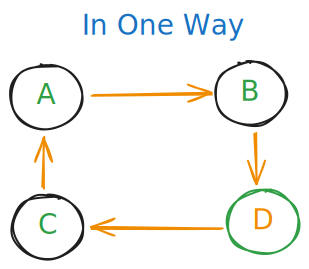

# Graphs - Data Structures Notes

## Table of Content

- [What are Graphs](#what-are-graphs)
- [Graph Representations](#graph-representations)

## What are Graphs

Graphs are a fundamental data structure consisting of:

- **Vertices (Nodes)**: The points or entities in the graph
- **Edges**: The connections between vertices

**Important Note**: Both linked lists and trees are special types of graphs.


## Graph Representations

### 1. Edge List

- [FROM-TO]

```python
[
  [0, 1],
  [1, 2],
  [3, 4],
  [3, 6]
]
```

### 2. Adjacency Matrix

- Can be inefficient if nodes have no neighbors (lots of zeros)
- Better to use adjacency list instead

```python
[
[0, 1, 0, 0], # vertex 0: connects to vertex 1
[0, 0, 1, 0], # vertex 1: connects to vertex 2
[1, 0, 0, 0], # vertex 2: connects to vertex 0
[0, 1, 0, 0] # vertex 3: connects to vertex 1
]
```

### 3. Adjacency List

```javascript
{
  0: [1, 3],
  1: [2],
  2: []
}
```

**Implementation**: Each node can be represented as a class with:

- `Node.val` (value)
- `Node.neighbors = []` (list of connected nodes)

---

## Types of Graphs

### 1. Directed Graph

- Edges have direction (one-way)
- A → B (A points to B only)
  

### 2. Undirected Graph

- Edges work both ways
- A — B (A connects to B and B connects to A)


### 3. Cyclic vs Acyclic

- **Cyclic**: Contains cycles (can return to starting point)
- **Acyclic**: No cycles

### 4. Sparse vs Dense

- **Sparse**: Few edges relative to possible connections
  - E < V\*(V-1)/2
- **Dense**: Many edges, high connectivity

## Graph Traversal Algorithms

### 1. Depth First Search (DFS)

> finish path by path go deep then when finish go to the another adjacent

#### Method 1: Recursion with Set

- make seen set to store each vertex we visit, so if we went here before don't go there again
- so using recursion when we reach the end of the path we return to the initial point again to check the another paths

```python
def dfs_recursive(node, seen):
    if node in seen:
        return
    seen.add(node)
    # process node
    for neighbor in node.neighbors:
        dfs_recursive(neighbor, seen)
```

#### Method 2: Stack with Set

- when we reach vertex we push it to the stack and the seen set, then process it
- after process it pop it and push it's adjacent to the stack and seen too to process them using LIFO
- and so on...

```python
def dfs_iterative(start):
    stack = [start]
    seen = {start}

    while stack:
        node = stack.pop()  # Last in, first out
        # process node
        for neighbor in node.neighbors:
            if neighbor not in seen:
                stack.append(neighbor)
                seen.add(neighbor)
```

- my code implementation
  [graph](../my_code/Data_Structures/graph/graph.py)

### 2. Breadth First Search (BFS)

> Unlike the **DFS** we must walk on all levels (paths) at same time

#### Using Queue with Set

- when we reach vertex we push it to the queue and the seen set, then process it
- after process it pop it and push it's adjacent to the stack and seen too to process them using FIFO [start with the first adjacent you pushed]
- and so on...

```python
from collections import deque

def bfs(start):
    queue = deque([start])
    seen = {start}

    while queue:
        node = queue.popleft()  # First in, first out
        # process node
        for neighbor in node.neighbors:
            if neighbor not in seen:
                queue.append(neighbor)
                seen.add(neighbor)
```

**Difference**:

- DFS explores **one path completely before backtracking**
- BFS explores **all neighbors at current level before going deeper**

- my code implementation
  [graph](../my_code/Data_Structures/graph/graph.py)

---

## Time and Space Complexity

For both DFS and BFS:

- **Time Complexity**: O(V + E)
  - V = number of vertices
  - E = number of edges
- **Space Complexity**: O(V + E)

---

## Trees as Graphs

Trees are a special type of graph with these properties:

- **Connected**: Path exists between any two nodes
- **Acyclic**: No cycles

**Formula for Trees**: If a tree has `n` nodes, it has exactly `n-1` edges.

Example: Tree with 4 nodes → 3 edges

---

## Interview Questions

- [Graph Interview Questions](./graph-interview.md)
