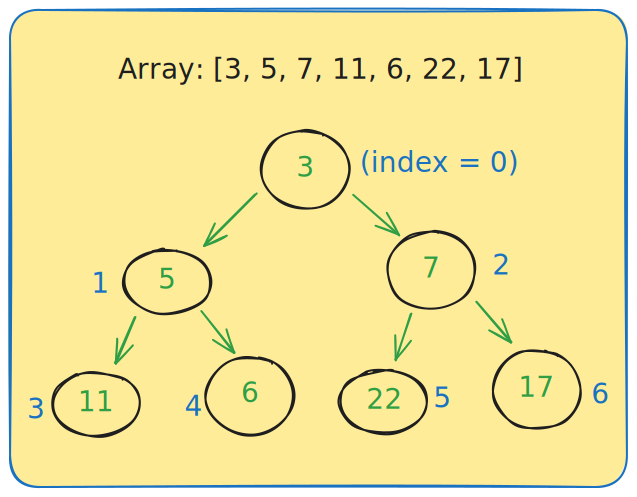

# Heap Data Structure

## What is a Heap?

A heap is a **complete binary tree** stored as an array that follows special ordering rules. Think of it as a priority queue where the most important element is always at the top (root).

## Two Types of Heaps:

- **Min-Heap**: Smallest element at root, parents ≤ children
  - my code implementation: [minheap](../my_code/Data_Structures/heap/min_heap.py)
- **Max-Heap**: Largest element at root, parents ≥ children
  - my code implementation: [maxheap](../my_code/Data_Structures/heap/max_heap.py)

## Array Representation

When we store the tree in an array, we can find:

- **Left child** of index `i`: `2i + 1`
- **Right child** of index `i`: `2i + 2`
- **Parent** of index `i`: `(i - 1) // 2`

### Example:

---

## What is Heapify?

**Heapify** is a process of converting a binary tree into a heap data structure. It ensures that the heap property is maintained throughout the tree where:

- In a **max heap**: each node is greater than or equal to its children
- In a **min heap**: each node is less than or equal to its children

The heapify process involves two main operations: **heapify up** and **heapify down**.

---

## Core Operations:

### 1. **Heapify-Up** (Fix upward)

**When to use:** After **insertion** of a new element that may violate the heap property.

**Process:**

- Compare the newly added element with its parent
- Swap them if necessary to maintain heap property
- Continue this process moving up until heap property is restored
- **Time**: O(log n)

### 2. **Heapify-Down** (Fix downward)

**When to use:** After **removing root** element (typically the min/max element).

**Process:**

- Replace the root with the last element in the heap
- "Sink" this element down the tree by comparing with children
- Swap with smallest/largest child if needed
- Continue until heap property is satisfied
- **Time**: O(log n)

### 3. **Insert (Push)**

1. Add new element at the end of array
2. Heapify-up to fix the heap

- **Time**:
  - O(log n)

### 4. **Delete-Min/Max (Pop)**

1. Replace root **with last element**
2. Remove the last element
3. Heapify-down from root

- **Time**:
  - O(log n)

### 5. **Peek**

- Just return `array[0]` (the root)
- **Time**:
  - O(1)

### 6. **Build-Heap**

- Start from last **internal** node: `(n-2)//2`
- Heapify-down from each internal node going backwards
- **Time**:
  - O(n) - efficient

## Why we use Heaps?

### Priority Queue = Heap

- Process elements by **priority** (not insertion order)
- OS task scheduling: high priority tasks first

### Heap Sort Algorithm

1. Build max-heap from unsorted array
2. Repeatedly extract max and place at end
3. **Time**: O(n log n), **Space**: O(1)
4. **One of the best sorting algorithms**

Check my Code: [heap_sort](../my_code/Data_Structures/heap/heap_sort.py)

## Time Complexity Summary:

| Operation       | Time Complexity |
| --------------- | --------------- |
| Build-heap      | O(n)            |
| Insert          | O(log n)        |
| Delete-min/max  | O(log n)        |
| Peek            | O(1)            |
| Heapify-up/down | O(log n)        |

## Applications:

- **Priority Queues**: OS schedulers, network routing
- **Dijkstra's Algorithm**: Shortest path finding
- **Heap Sort**: Efficient sorting
- **Event Simulation**: Process events by time
- **Top K Problems**: Find K largest/smallest elements

## Important Notes

1. **Complete binary tree stored in array**
2. Parent-child relationship maintains order
3. **Root** always contains **min/max element**
4. Insertion and deletion are O(log n)
5. Building heap from scratch is O(n)

---

## Interview Questions

- [Heap Interview Questions](./heap-interview.md)
