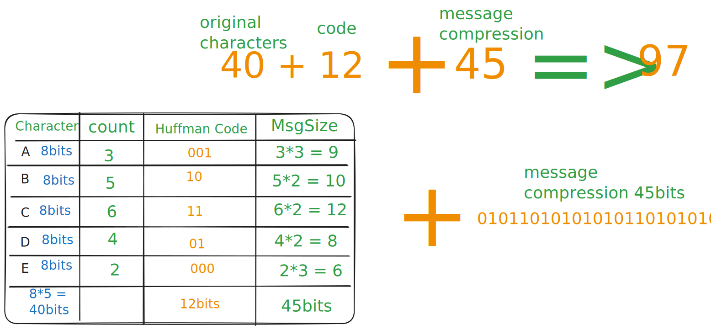

# Huffman Coding Algorithm

## Table of content

- [What is Huffman Coding](#what-is-huffman-coding)
- [How it works](#how-it-works)
- [Example](#example)
- [pseudo Code](#pseudo-code)

## What is Huffman Coding

> It's an algorithm to **reduces file sizes** without losing any information

## How it works

> This algorithms assigns **shorter codes** to more frequent characters and **longer codes** to less frequent characters

## Example

- **Suppose we have message with length of 20 characters**
  `message = BCCADBBDABBCCADDCCEE`

  - we know that each character `ASCII` take 8 bits (1 byte) to represent
    - A = 65 (ASCII) = 01000001
  - so by this way the `message size` will be => 20 \* 8 = `160 bits`

  - but we have just 5 unique characters, why to store each one in 8 bits
    - so how many bits I need to represent each character after compression?
      - we need 3 bits to represent each character after compression why??
        - because we have 5 unique characters and 3 bits can represent 2^3 = 8 different values
        - we cant use 2 bits because 2 bits can represent only 4 different values
  - so instead of representing each character with 8 bits, we can represent it with 3 bits after compression
    - so the `maximum message size after compression` = 20 \* 3 = `60 bits`
      - **in maximum so maybe some high frequent characters will take less than 3 bits**
      - so 3 bits for each character in maximum

- **Another thing** - by this above we make the compression - but if we need to decode it again into real ASCII characters, how the computer will understand this message code for any character (know how to reconstruct the original message) - so we will not just send the **compression message** which in this example is `45 bits` by itself, but also will send two things with it - we need to send the huffman table [real characters + huffman codes] - each real character and the huffman code for it - so the total size of the message after compression will be `40 + 12 + 45 = 97bits` instead of `160bits`
  

## pseudo Code

**1. Calculate Character Frequencies**
Count how many times each character appears in the data.

**2. Build Huffman Tree**

- Use a **priority queue** (min-heap)
- Start with leaf nodes for each character
- Repeatedly merge the two nodes with lowest frequencies
- Continue until only one node remains (the root)

**3. Generate Huffman Codes**

- Traverse the tree from root to each leaf
- Assign '0' for left edges, '1' for right edges
- The path from root to leaf gives the character's code

**4. Encode Data**
Replace each character with its Huffman code.

**5. Decode Data**
Use the Huffman tree to convert codes back to original characters.

## Prefix-Free Property

- because we send huffman table [for each ASCII characters send also its huffman code]
- so by this will know where each character start and finish based on the message code
- no prefix signs just the encoded message itself
