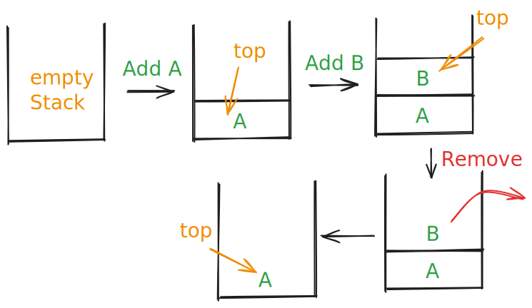
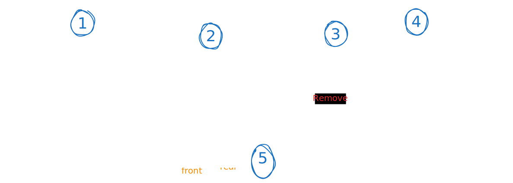
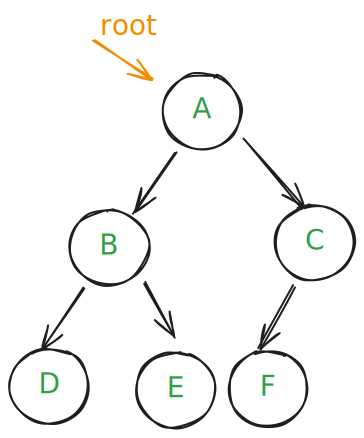
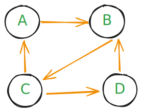

# Introduction to Data Structures

## Table of Contents

1. [What Are Data Structures](#what-are-data-structures)
2. [Types of Data Structures](#types-of-data-structures)
   - [1. Primitive Data Types](#1-primitive-data-types)
   - [2. Non-Primitive Data Structures](#2-non-primitive-data-structures)
     - [2.1 Linear Data Structures](#21-linear-data-structures)
     - [2.2 Non-Linear Data Structures](#22-non-linear-data-structures)
3. [Which Data Structure to Choose](#which-data-structure-to-choose)

---

## What Are Data Structures

Data structures are the way of organizing and store data in a computer's memory [Random-Access-Memory-(RAM)](<../attachment/images/Random-Access-Memory-(RAM).svg>)

> Just like you organize your clothes differently in a closet (hanging shirts, folding pants in drawers, shoes on racks), we organize data differently based on how we plan to use it.

---

## Types of Data Structures

### 1. Primitive Data Types

- **Integer** (whole numbers): `42`, `-17`
- **Float** (decimal numbers): `3.14`, `-2.5`
- **Character** (single letters/symbols): `'A'`, `'@'`
- **Boolean** (true/false): `true`, `false`

### 2. Non-Primitive Data Structures

#### 2.1 Linear Data Structures

> Data elements are arranged in a sequential order.

##### - **Array**


- Stored in **sequential memory locations**
- very **fast accessing** => **O(1)** zero-based-index
- the address for each element is
  - `address = base_address + (index × element_size)`
  - in each index we store the address which refer to the value into the real address in the Random-Access-Memory-(RAM)
- **Best for**:
  - When you need fast access by position
- **Weakness**:
  - Fixed size, slow insertion/deletion in middle

##### - **[Linked List](../my_notes/linked-list.md)**


- **Nodes scattered in memory,** connected by **pointers**
- **slow accessing** must traverse from the start (head of the list)
- **Best for**:
  - Frequent insertions/deletions
- **Weakness**:
  - No direct access to elements

##### 3. **[Stack](../my_notes/stack.md)**



- follow Last In, **First Out (LIFO) principle**
- Imagine it like [[My Brain/Software Engineering/stack|Stack]] of books
- **Use cases**:
  - Function calls and 
  - undo operations
  - expression evaluation

##### 4. **[Queue](../my_notes/queue.md)**



- follow Last In, **First In, First Out (FIFO) principle**
- Imagine it like queue of student before enter the classroom
- **Use cases**:
  - Task scheduling
  - breadth-first search

#### 2.2 Non-Linear Data Structures

Data elements are not in sequential order.

##### 1. **[Tree](../my_notes/tree.md)**



- **Hierarchical** structure with **parent-child relationships**
- **Use cases**:
  - File system
  - HTML DOM
  - decision making

##### 2. **[Graph](../my_notes/graph.md)**



- Nodes (**vertices**) connected by **edges**
- **Use cases**:
  - Social networks
  - maps

##### 3. **[Hash Tables (Dictionaries)](../my_notes/hash-tables.md)**

```
Key "apple"  → Hash Function → Index 3 → [apple: red]
Key "banana" → Hash Function → Index 7 → [banana: yellow]
```

- Uses hash function to **convert keys to array indices**
- Average `O(1)` for insert, delete, search
- **Use cases**:
  - Databases
  - caches

---

## Which Data Structure to Choose

### Why Do We Need Different Data Structures

> Every data structure excels at certain operations:

### Choosing the Right Data Structure

- Need **fast access** by position? → **Array**
- Need **frequent insertions/deletions**? → **[Linked List](../my_notes/linked-list.md)**
- Need **fast lookups** by key? → **[Hash Table](../my_notes/hash-tables.md)**
- Working with **hierarchical data**? → **[Tree](../my_notes/tree.md)**
