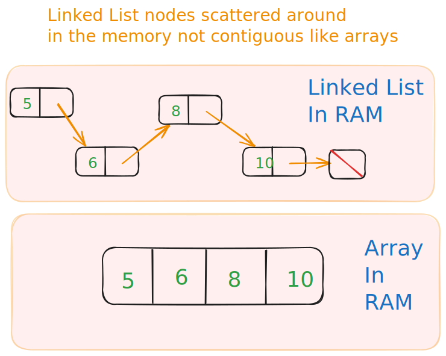
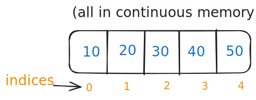
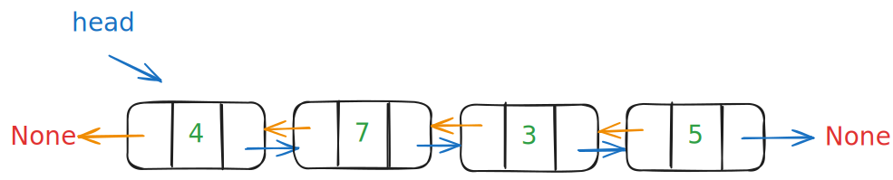
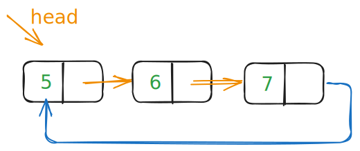

# Linked Lists

## Table of Contents

1. [What is a Linked List](#what-is-a-linked-list)
2. [Linked List vs Array](#linked-list-vs-array)
3. [Types of Linked Lists](#types-of-linked-lists)
   - [1. Singly Linked List (SLL)](#1-singly-linked-list-sll)
   - [2. Doubly Linked List (DLL)](#2-doubly-linked-list-dll)
   - [3. Circular Linked List (CLL)](#3-circular-linked-list-cll)
4. [Time Complexity](#time-complexity)
5. [Important Notes](#important-notes)
6. [Examples using Linked List](#examples-using-linked-list)
7. [Summary](#summary)
8. [Interview Questions](#interview-questions)

---

## What is a Linked List

### Simple Definition

> **A linked list is like stairs** - each floor (**node**) **points** to the next floor. You can't skip ahead. you must follow the chain step by step.

- we refer to our linked list and catch it by pointing into the first node using **head** pointer
  - each linked list contains
    - head
    - tail/length **(optionally)**
      - tail enhanced dealing with the end of the list to **O(1)** at most operations
        - such as insert at end
        - but remove still **O(n)** because we need the node before the deleted one to change it's pointer


### Technical Definition

- A **linear data structure** where elements (**nodes**) are connected using **pointers**
- **Memory is NOT continuous** - elements are **scattered around** - each node stored in random (slot)
  
- Each **node** contains:
  - **Data** (the actual value)
  - **Pointer** (address to the next node)

```python
class Node:
	def __init__(self, data):
		self.data = data
		self.next = None
```

---

## Linked List vs Array

### From where the idea of linked list came

> arrays are awesome and it have fixed access time **O(1)**, but has many problems such as: - arrays have bad insertion/removal at start, and middle [must shift all elements] - also arrays have fixed size and we must resizing them with double the size - also it's in contiguous order in memory [suppose I need to create an array with size 500 and there's no 500 free contiguous addresses]
>
> - so we create the linked list which is has

### Linked List = Stairs

- **You must go step by step:**
  - To reach floor 5: must go from 1 → 2 → 3 → 4 → 5
  - **Can't skip floors** (no direct access like array)
- **Easy to add/remove floors** anywhere in between


---

### Array = Elevator

- **You can jump directly to any floor you want**
  - Want floor 5? You can directly go there
  - **Direct access** to any floor (using indices)
- **Hard to add floors** - must rebuild everything [shifting all floors]



### Comparison Summary

| Feature           | Linked List (Stairs)                                     | Array (Elevator)                         |
| ----------------- | -------------------------------------------------------- | ---------------------------------------- |
| **Access Speed**  | Slow O(n) - floor by floor                               | Fast O(1) - jump directly                |
| **Insert/Delete** | Easy - just change pointers                              | Cost - must shift everything             |
| **Memory**        | **Scattered** everywhere                                 | All together in a row (contiguous)       |
| **Use When**      | when need adding/removing a lot                          | a Lot of accessing                       |
| **Memory Space**  | use more memory **(storing pointers)** but more flexible | **memory efficient** (no extra pointers) |

---

## Types of Linked Lists

### 1. Singly Linked List (SLL)

**the basic type - Just in one direction**


**each node has:**

- `data` - the actual value of the item
- `next` - pointer to next node

**Common operations:**

- `push` - insert to end
- `pop` - remove from end
- `shift` - remove from start
- `unshift` - insert to start
- `get` - find node at position
- `insert` - add node anywhere
- `remove` - delete node anywhere

**Time Complexity:**

- Insert at start: **O(1)** (very fast)
- Insert at end: **O(n)** (must walk from the head to the end of the list)
  - if we have also tail so will be also **O(1)**
- Remove from start: **O(1)**
- Remove from end: **O(n)** (must find the node before the last node to change it's pointer)
- Search: **O(n)** (must check each node)

**Check my implementation of Singly Linked List**:

- [1. Singly Linked List with head](../my_code/Data_Structures/linked_list/singly_linked_list/singly_linked_list_head.py)
- [2. Singly Linked List with head & tail](../my_code/Data_Structures/linked_list/singly_linked_list/singly_linked_list_head_tail.py)

### 2. Doubly Linked List (DLL)

**Can go both directions**



**each node has:**

- `data` - the actual value
- `next` - pointer to next node
- `prev` - pointer to previous node

**Benefits:**

- Can traverse in **both directions**
- **Easier deletion** if we have tail (don't need to find previous node) **O(1)**
- Can start from **head OR tail** for searching (**Smart Searching**)
  - so if the item is closer to the tail we can start from there to get better timing
  - If target is in first half → start from head
  - If target is in second half → start from tail
  - Still O(n) but **roughly twice as fast**

**Check my implementation of Doubly Linked List**:

- [Doubly Linked List with head](../my_code/Data_Structures/linked_list/doubly_linked_list/doubly_linked_list.pyy)

### 3. Circular Linked List (CLL)

**Last node points back to first - make a loop**



**Benefits:**

- **No NULL checks** - never reach end (keep looping)
  - so by this we won't get **runtime error**
- Can **start from any node** and reach to any other node

- **Example:**
  - Music playlists (repeat)

**Types:**

- **Circular Singly** - one direction loop
- **Circular Doubly** - both directions loop

**Check my implementation of Circular Linked List**:

- [1. Circular Singly Linked List](../my_code/Data_Structures/linked_list/singly_linked_list/circular_singly_linked_list.py)
- [2. Circular Doubly Linked List](../my_code/Data_Structures/linked_list/doubly_linked_list/circular_dobuly_linked_list.py)

---

## Time Complexity

| Operation                 | SLL                                       | DLL                                                    | Circular SLL                              | Circular DLL                                           |
| ------------------------- | ----------------------------------------- | ------------------------------------------------------ | ----------------------------------------- | ------------------------------------------------------ |
| **Insert at beginning**   | O(1)                                      | O(1)                                                   | O(1)                                      | O(1)                                                   |
| **Insert at end**         | O(n) without tail<br>O(1) with tail       | O(n) without tail<br>O(1) with tail                    | O(n) without tail<br>O(1) with tail       | O(n) without tail<br>O(1) with tail                    |
| **Remove from beginning** | O(1)                                      | O(1)                                                   | O(1)                                      | O(1)                                                   |
| **Remove from end**       | O(n) must reach the node before last node | O(1) with tail (because we can get the node before it) | O(n) must reach the node before last node | O(1) with tail (because we can get the node before it) |
| **Search/Access**         | O(n)                                      | O(n)                                                   | O(n)                                      | O(n)                                                   |
| **Traversal**             | O(n)                                      | O(n)                                                   | O(n)                                      | O(n)                                                   |

## Important Notes

1. **Never modify head/tail directly Just use temp variable**

   ```python
   # ❌ DON'T DO THIS
   head = head.next

   # ✅ DO THIS
   current = head
   while current:
       # do something
       current = current.next
   ```

2. **Always check for None/NULL**
   - to know when we reach the end
   ```python
   if current is not None:
       current = current.next
   ```

---

## Examples using Linked List

- **Undo/Redo functionality** (doubly linked)
- **Browser history** (back/forward buttons)
- **Music playlists** (circular)
- **Memory management** in operating systems

---

## Summary

- **linked list** is nodes connected by pointers like chain with flexible insertion/deletion
  - while array offer direct access with cost insertion/deletion
- when to use each one
  - lots of insertion/deletion => **Linked List**
  - lots accessing by index => **Array**
  - need to go backwards => **Doubly Linked List**
  - need to loop continuously => **Circular Linked List**

## Interview Questions

- [Linked List Interview Questions](./linked_list-interview.md)
