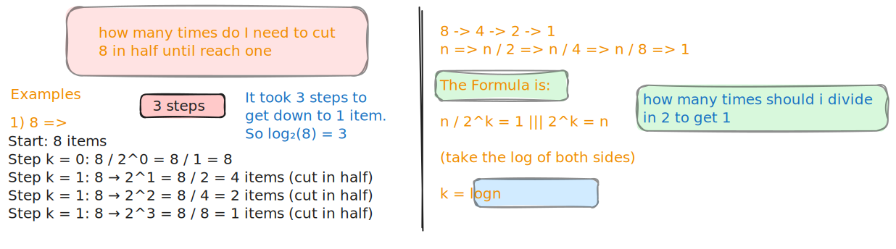

# Logarithms and O(log n)

## Table of Content

1. [What is a Logarithm in DS](#what-is-a-logarithm-in-ds)
   - [from where this came](#from-where-this-came)
2. [How it works](#how-it-works)
3. [Binary Search Example](#binary-search-example)
4. [Another common algorithms](#another-common-algorithms)
5. [Some Tricks](#some-tricks)
6. [Why should I learn it](#why-should-i-learn-it)
7. [Summary](#summary)

## What is a Logarithm in DS

> In Short:
> A logarithm is basically asking **how many times do I need to cut this in half to get to 1?**

### from where this came

Let's say I have 8 items and I keep cutting the group in half:



---

## How it works

- As the data size grow, the number of steps **grows very slowly**
- **8 items =>** 3 steps (2^3 = 8)
- **1000 items =>** 10 steps (2^10 = 1000)
- **1000000 items =>** 20 steps (2^20 = 1 million)

- **Why I love it**
  - **O(log n) barely slows down as data grows!**

## Binary Search Example

```python
# Looking for number 7 in: [1, 3, 5, 7, 9, 11, 13, 15]
def binary_search(arr, target):
    left = 0
    right = len(arr) - 1

    while left <= right:
        mid = (left + right) // 2

        if arr[mid] == target:
            return mid
        elif arr[mid] < target:
            left = mid + 1    # Cut out left half
        else:
            right = mid - 1   # Cut out right half
```

- Each time through the loop

  - we **cut the remaining array in half**.

- With **8 items**: **maximum 3 steps** (log₂(8) = 3)
- **With 1000 items**: **maximum ~10 steps** (log₂(1000) ≈ 10)

- **It's very efficient** We can search through 1000 items **in just 10 steps!**

---

## Another common algorithms

### 1. Binary Search

- **Use**: Finding items in sorted lists
- **Time**: O(log n)
- **Example**: Phone book lookup

### 2. Balanced Trees

- **Use**: Database operations, file systems
- **Time**: O(log n) for insert, delete, search
- **Example**: Finding a file in organized folders

### 3. Merge Sort (partially)

- **Time**: O(n log n)
- The "log n" part: splitting arrays in half
- The "n" part: merging back together

### 4. Heap Operations

- **Use**: Priority queues, sorting
- **Time**: O(log n) for insert/delete

### 5. Any "Divide and Conquer" Algorithm

- If you're cutting the problem in half each time

---

## Some Tricks

When I see code and want to know if it's O(log n):

- **Dividing by 2**

  ```python
  while n > 1:
  	n = n // 2 # Cutting in half each loop
      # do something
  ```

- **binary search**

  ```python
  while left < right:
  	mid = (left + right) // 2 # Finding middle
  	# decide which half to keep
  	# throw away the other half
  ```

- **Tree Traversal**
  ```python
  while current is not None:
  	if target < current.value:
  		current = current.left # Go left
  	else:
  		current = current.right # Go right
  ```

**In Short:**

- Cutting the problem/data in **half each iteration**
- **Binary search** patterns
- Variables that multiply/divide by 2 each loop
  - like **n \* 2 or n / 2**

---

## Why should I learn it

- **In Interviews** They love asking about O(log n) algorithms
- **Real applications:**
  - Database searches
  - Finding files in organized systems
  - Any time you need to search through lots of sorted data

---

## Summary

- **Logarithm**
  - how many times can I cut this in half?
- **O(log n)**
  - **very efficient**, ==barely slows down as data grows==
- **Use it in**:
  - Binary search in sorted arrays
  - operations in balanced trees
  - divide-and-conquer algorithms
- **Why I love it:**
  - Can **handle huge amounts of data** with just a **few extra steps**
- ==Remember:== **O(log n)** is really, really good. If I can make my algorithm O(log n), **I should probably do it!**
