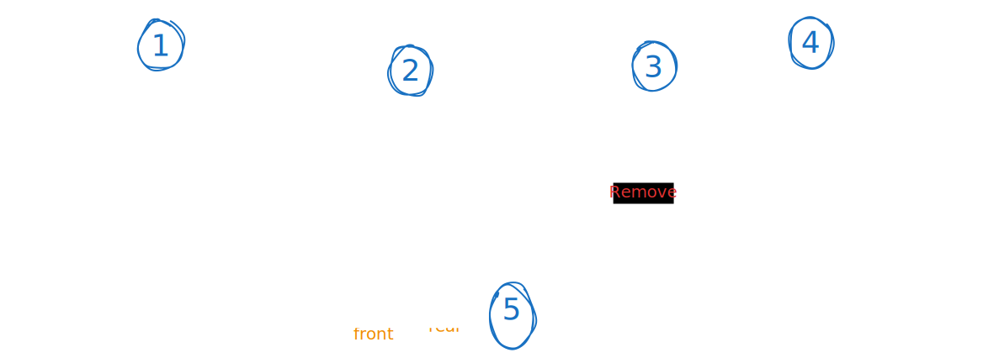

# Queue

## Table of Content

1. [What is a Queue](#what-is-a-queue)
2. [How it works](#how-it-works)
3. [Stack Vs. Queue](#stack-vs-queue)
4. [Examples use Queues](#examples-use-queues)
5. [Implementation](#implementation)
6. [Types of queues](#types-of-queues)
7. [Time Complexity](#time-complexity)
8. [Important Notes](#important-notes)
9. [Interview Questions](#interview-questions)

## What is a Queue

> A **queue** is a linear data structure that follows the **FIFO** (First In, First Out) principle.

Imagine it like **queue of students**

- the first student will be in the queue is the first student will enter the classroom

## How it works

- **FIFO Principle**: The first element added is the first one to be removed
- **Two-End Access**:
  - Add at rear (back)
  - remove from front
- **Two Main Operations**:
  - Enqueue (add)
  - Dequeue (remove)
- **Queue Operations:**
  - **Enqueue**: New person joins at the rear (back of line)
  - **Dequeue**: Person at front gets served and leaves
  - **Peek/Front**: Look at who's next to be served

---

## Stack Vs. Queue

| Aspect            | Stack (LIFO)       | Queue (FIFO)                        |
| ----------------- | ------------------ | ----------------------------------- |
| **Principle**     | Last In, First Out | First In, First Out                 |
| **Access Points** | **Top** only       | **Front** (remove) + **Rear** (add) |
| **Analogy**       | Stack of books     | Line of people                      |
| **Operations**    | Push/Pop           | Enqueue/Dequeue                     |

---

## Examples use Queues

- **Process Scheduling** → OS managing tasks
- **Breadth-First Search (BFS)** → Graph algorithms
- **Web Servers** → Handling requests in order
- **Print Queues** → Documents waiting to print
- **Streaming** → Audio/video buffering
- **Call Centers** → Managing customer calls

## Implementation

### 1. Using Array

- one of the operations will be **O(n)**

  - the process at end will be O(1)
  - and the process at beginning of the array will be Costly **O(n)**

- **My implementation**
  [Queue Using Array](../my_code/Data_Structures/stack_and_queue/queue_Array_implementation.py)

### 2. Using Linked List

- its amazing using linked list

  - can insert to head O(1), remove from tail O(1)
  - or insert to tail O(1), and remove from head O(1)

- **My implementation**
  [Queue Using List](../my_code/Data_Structures/stack_and_queue/queue_list_implementation.py)

## Types of queues

- **Simple Queue** → Basic FIFO
- **Circular Queue** → Array wraps around
- **Priority Queue** → Elements have priorities
- **Double-Ended Queue (Deque)** → Add/remove from both ends

---

## Time Complexity

| Operation      | Time Complexity | Description                |
| -------------- | --------------- | -------------------------- |
| **Enqueue**    | O(1)            | Add element to rear        |
| **Dequeue**    | O(1)            | Remove element from front  |
| **Front/Peek** | O(1)            | View front element         |
| **Rear**       | O(1)            | View rear element          |
| **Search**     | O(n)            | Find specific element      |
| **Access**     | O(n)            | Access element at position |

- in array implementation one of the process (enqueue, dequeue) will be **O(1)** and the other one will be **O(n)**

---

## Important Notes

1. **FIFO Principle**: First In, First Out - opposite of stack
2. **Two-Point Access**: Front for removal, rear for addition
3. **O(1) Operations**: Enqueue and dequeue are constant time
4. **Implementation Choice**: Linked list generally preferred for dynamic size
5. **Circular Arrays**: Efficient for fixed-size queues
6. **BFS Essential**: Critical for graph traversal algorithms

## Interview Questions

- [Queue Interview Questions](./queue-interview.md)
