# Tree Data Structure

## Table of Content

- [What is a Tree?](#what-is-a-tree)
- [Tree Terminology](#tree-terminology)
- [Height vs Depth of a Tree Node](#height-vs-depth-of-a-tree-node)
- [Tree Implementation](#tree-implementation)
- [Lists vs. Trees](#lists-vs-trees)
- [Can’t Be a Tree](#cant-be-a-tree)
- [Examples Using Trees](#examples-using-trees)
- [Types of Trees](#types-of-trees)
- [Tree Traversals](#tree-traversals)
- [Interview Questions](#interview-questions)

---

## What is a Tree?

- A **hierarchical** data structure composed of **nodes** connected by edges.
- Each node can have child nodes, creating a parent-child relationship.
- The top node is called the **Root**.

  

---

## Tree Terminology

- **Node:** Data element in the tree.
- **Root:** Topmost node (starting point).
- **Parent:** Node with child nodes.
- **Child:** Node connected below a parent.
- **Siblings:** Nodes sharing the same parent.
- **Leaf:** Node with no children (External Node).
- **Edge:** Connection between two nodes.
- **Internal Node:** Node with at least one child.
- **Subtree:** A node and all its descendants.
- **Depth:** Number of edges from root to the node.
- **Height:** Number of edges in the longest path from a node down to a leaf.

---

## Height vs Depth of a Tree Node

Understanding **height** and **depth** is key to mastering tree structures.

### Depth of a Node

- **Depth** is the number of edges **from the root node down to the node**.
- The root node has depth **0**.
- Each level down increases the depth by 1.

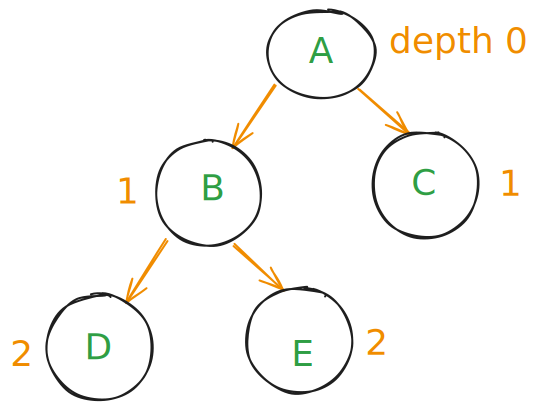

- Depth of `A` = 0
- Depth of `B` and `C` = 1
- Depth of `D` and `E` = 2

---

### Height of a Node

- **Height** is the number of edges **on the longest path from the node down to a leaf**.
- A leaf node has height **0**.
- Height is calculated bottom-up.
  **ASCII Example:**

  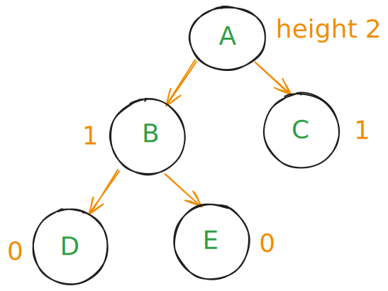

- Height of `D` and `E` = 0 (leaves)
- Height of `B` and `C` = 1
- Height of `A` = 2 (longest path: A → B → D or A → C → E)

---

## Tree Implementation

### 1. Using Linked List (Nodes with Left & Right pointers)

```python

class Node:

    def __init__(self, val):

        self.val = val

        self.left = None

        self.right = None

```

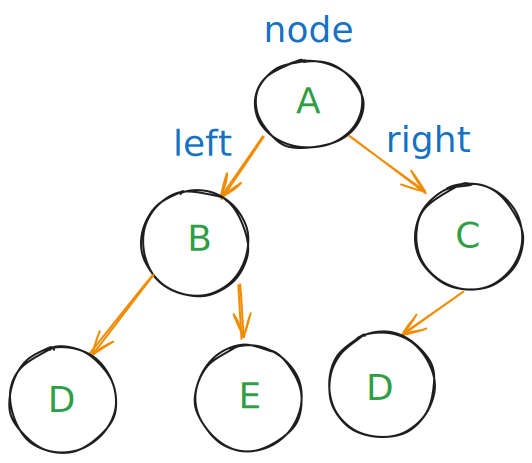

---

### 2. Using Array Representation

- **Index rules:**

- Root at index 0
    - Left child of node at index `i`: `2i + 1`
    - Right child of node at index `i`: `2i + 2`
    - Parent of node at index `c`: `(c - 1) // 2`

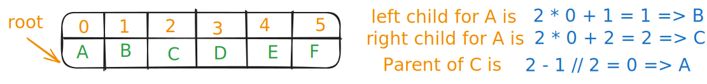

---

## Lists vs. Trees

- Linked Lists are linear — each node points to one next node.
- Trees are hierarchical — nodes can have multiple children.

**list**


**Tree**


---

## Can’t Be a Tree

- Nodes that reference siblings directly (only parent → child links allowed)
- Multiple roots — a valid tree has only **one root**

---

## Examples Using Trees

- File systems
- Web DOM
- Expression parsing
- Routing
- hierarchical of Operating Systems like linux

---

## Types of Trees

### 1. General Tree

- No limit on number of children.
  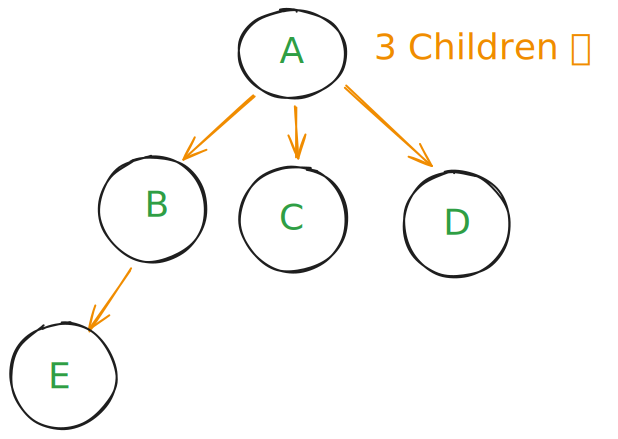

### 2. Binary Tree

- Each node has up to two children.

  - so 0, 1, 2
    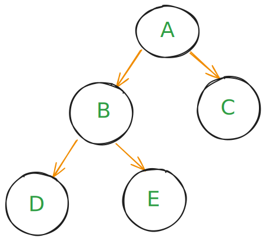

- See my code: [Binary Tree](../my_code/Data_Structures/tree/binary_tree.py)

### 3. Full Binary Tree

- Every internal node has exactly two children.

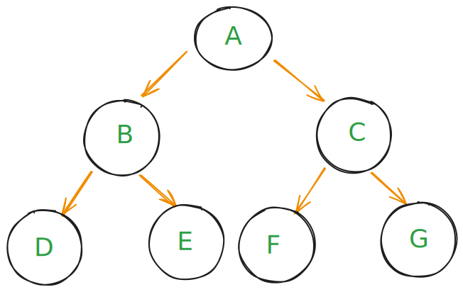

### 4. Complete Binary Tree

- must fill level by level from left to right

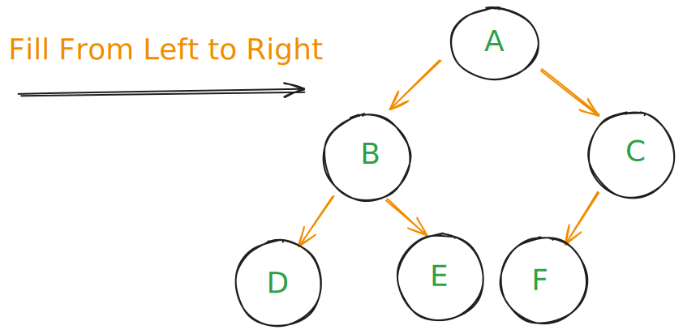

### 5. [Balanced Tree (AVL)](./avl_tree.md)

- For every node, the height difference (balance factor) between left and right subtrees is **-1, 0, or +1**.

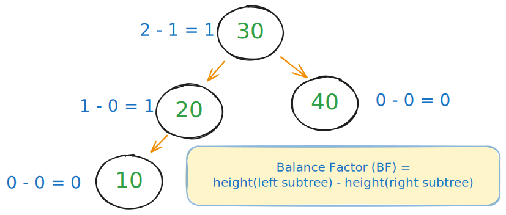

### 6. Binary Search Tree (BST)

- Binary tree with rule: left subtree < node < right subtree

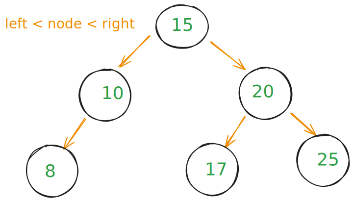

- See my code:
  - [BST Iteratively](../my_code/Data_Structures/tree/binary_search_tree_Iteritavely.py)
  - [BST Recursion](../my_code/Data_Structures/tree/binary_search_tree_recursion.py)

#### Big O Complexity (BST)

| Operations | Average  | Worst Case |
| ---------- | -------- | ---------- |
| Insert     | O(log n) | O(n)       |
| Search     | O(log n) | O(n)       |
| Delete     | O(log n) | O(n)       |

---

## Tree Traversals

- **Preorder** (Root → Left → Right)

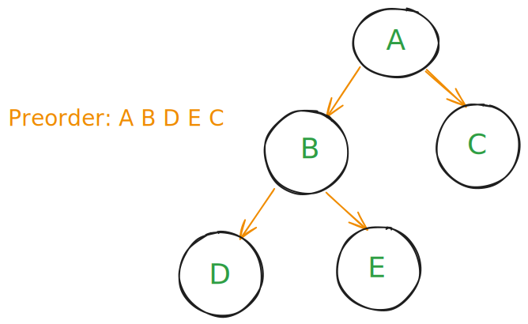

- **Inorder** (Left → Root → Right)
  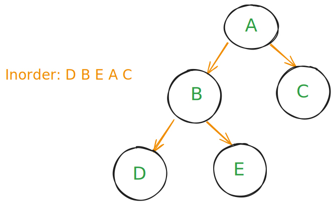

- **Postorder** (Left → Right → Root)

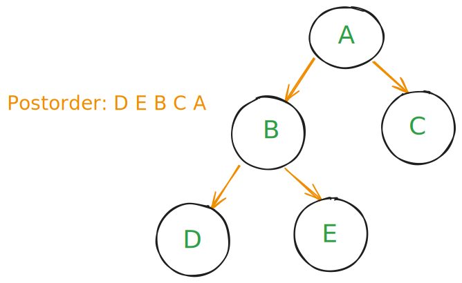

---

## Interview Questions

- [Trees Interview Questions](./tree-interview.md)
